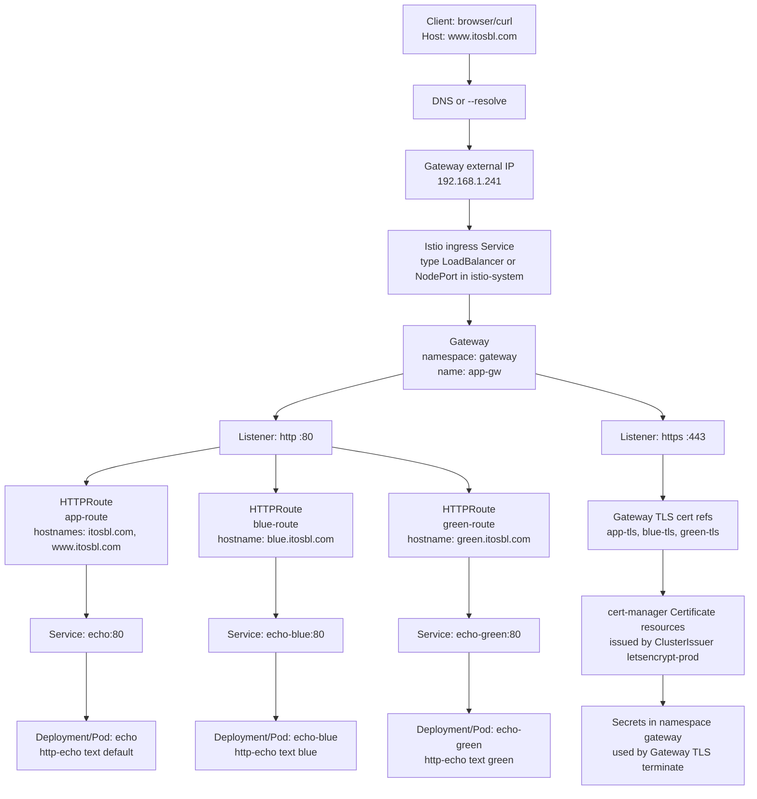

# Istio Gateway Actual Flow (Your Objects)

## Match Rules

- `www.itosbl.com` must be present in `app-route.hostnames` to select backend `echo`.
- `www.itosbl.com` must be present in `Certificate app-tls dnsNames` for valid HTTPS.
