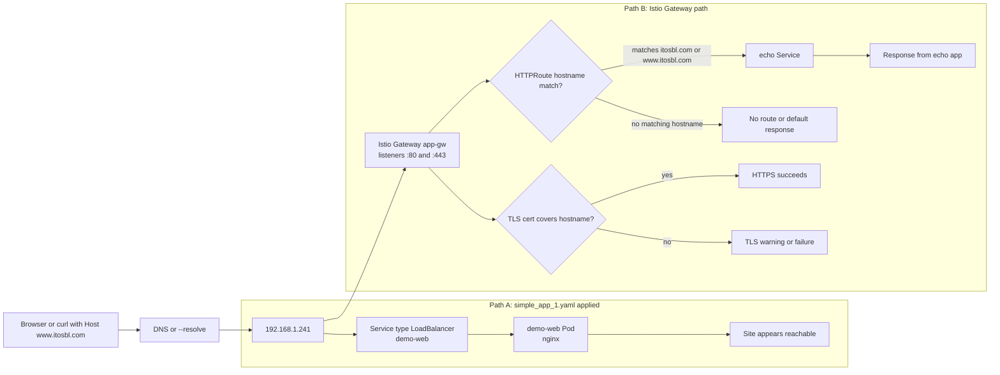

# Traffic Paths Overview

## Notes

- Applying `simple_app_1.yaml` creates a direct public entrypoint (`LoadBalancer`), so access can work even if Istio route/cert is incomplete.
- Istio path requires both route hostname match and certificate coverage for HTTPS.
